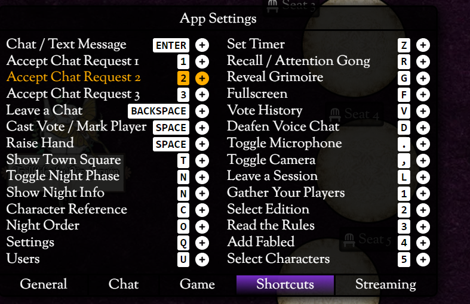

# Blood on the Clocktower intro

## I den trötta byn Ravenswood Bluff

## Tokens
I spelet så har ni alla en hemlig identitet. Du kommer få en token som antingen är blå eller röd. De blåa är goda och de röda är onda, vilket är laget du vinner tillsammans med. De blåa (goda) vinner ifall det inte finns någon demon kvar och de röda (onda) vinner ifall det är färre än tre spelare kvar och demonen är vid liv.

## Dag och natt
Spelet går i två faser, nattfasen och dagsfasen. På natten får 
många karaktärer lära sig information och den onda impen får till och med
döda!

På dagen så får ni diskutera och försöka lösa pusslet vem som egentligen är
eran demon, och på kvällen får ni besluta vem utav er som ska bli utröstad
och dö.

I Blood on the Clocktower så får spelarna alltid prata, även på natten!
Ibland kan det hända att jag ber er vara tysta så att någon annan ska få
göra sin röst hörd och jag rekommenderar att ni inte pratar om spelet under
första natten.

## Döden är inte slutet!
Ifall, eller mest troligt när, du dör så är du fortfarande med i spelet! Alla spelare är med tills spelet är vunnet eller förlorat och du får prata hur mycket du vill. Döda spelare har dock bara en röst kvar och förlorar sin förmåga om deras förmåga inte säger något annat

## Drunk / Poison
Drunk/Poison innebär att din förmåga inte fungerar som det ska.
I Trouble Brewing kommer det antingen från den onde Poisoner eller outsidern Drunk

## Gå igenom appen
Kortkommandon

### Mute/Stäng av video
, och .

### Klicka på brickorna för att ändra karaktär
På dig själv eller andra

### Voice, Text till vänster
Enterknappen

### Karaktärer till höger
Se din och andra karaktärer

